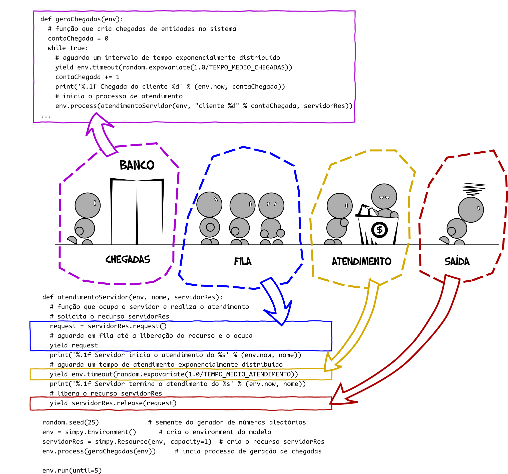

# Exemplo Fila M\/M\/1

A fila M/M/1 \(ver [Chwif e Medina, 2015](http://livrosimulacao.eng.br/e-tetra-e-tetra-a-quarta-edicao-do-msed/%29\) representa um sistema simples em que clientes chegam para atendimento em um servidor de fila única, com intervalos entre chegadas sucessivas exponencialmente distribuídos e tempos de atendimentos também exponencialmente distribuídos.

Para este exemplo, vamos considerar que o tempo médio entre chegadas sucessivas é de 1 min \(ou seja, uma taxa de chegadas de 1 cliente/min\) e o tempo médio de atendimento no servidor é de 0,5 min \(ou seja, uma taxa de atendimento de 2 clientes/min\). Como um experimento inicial, o modelo deve ser simulado por 5 minutos apenas.

## Geração de chegadas de entidades

Partindo da função `geraChegadas,` codificada na seção "Primeiro passo em SimPy: criando entidades", precisamos criar uma função ou processo para ocupar, utilizar e desocupar o servidor. Criaremos uma função `atendimentoServidor` responsável por manter os clientes em fila e realizar o atendimento.

Inicialmente, vamos acrescentar as constantes `TEMPO_MEDIO_CHEGADAS` e `TEMPO_MEDIO_ATENDIMENTO`, para armazenar os parâmetros das distribuições dos processos de chegada e atendimento da fila. Adicionalmente, vamos criar o recurso `servidorRes` com capacidade de atender 1 cliente por vez.

```python
import random                           # gerador de números aleatórios
import simpy                            # biblioteca de simulação

TEMPO_MEDIO_CHEGADAS = 1.0              # tempo médio entre chegadas sucessivas de clientes
TEMPO_MEDIO_ATENDIMENTO = 0.5           # tempo médio de atendimento no servidor

def geraChegadas(env):
    # função que cria chegadas de entidades no sistema
    contaChegada = 0
    while True:
        # aguardo um intervalo de tempo exponencialmente distribuído
        yield env.timeout(random.expovariate(1.0/TEMPO_MEDIO_CHEGADAS))
        contaChegada += 1
        print('%.1f Chegada do cliente %d' % (env.now, contaChegada))

random.seed(25)                                 # semente do gerador de números aleatórios
env = simpy.Environment()                       # cria o environment do modelo
servidorRes = simpy.Resource(env, capacity=1)   # cria o recurso servidorRes
env.process(geraChegadas(env))                  # incia processo de geração de chegadas

env.run(until=5)                                # executa o modelo por 5 min
```

## Realizando o atendimento no servidor

Se você executar o script anterior, o recurso é criado, mas nada acontece, afinal, não existe ainda nenhum processo requisitando o recurso.

Precisamos, portanto, construir uma nova função que realize o _processo_ de atendimento. Usualmente, um processo qualquer tem ao menos as 4 etapas a seguir:

1. Solicitar o servidor;
2. Ocupar o servidor;
3. Executar o atendimento por um tempo com distribuição conhecida;
4. Liberar o servidor para o próximo cliente.

A função `atendimentoServidor`, a seguir, recebe como parâmetros o `env` atual, o `nome` do cliente e a recurso `servidorRes` para executar todo o processo de atendimento.

```python
import random                           # gerador de números aleatórios
import simpy                            # biblioteca de simulação

TEMPO_MEDIO_CHEGADAS = 1.0              # tempo médio entre chegadas sucessivas de clientes
TEMPO_MEDIO_ATENDIMENTO = 0.5           # tempo médio de atendimento no servidor

def geraChegadas(env):
    # função que cria chegadas de entidades no sistema
    contaChegada = 0
    while True:
        # aguardo um intervalo de tempo exponencialmente distribuído
        yield env.timeout(random.expovariate(1.0/TEMPO_MEDIO_CHEGADAS))
        contaChegada += 1
        print('%.1f Chegada do cliente %d' % (env.now, contaChegada))

def atendimentoServidor(env, nome, servidorRes):
    # função que ocupa o servidor e realiza o atendimento
    # solicita o recurso servidorRes
    request = servidorRes.request()     

    # aguarda em fila até a liberação do recurso e o ocupa
    yield request                       
    print('%.1f Servidor inicia o atendimento do %s' % (env.now, nome))

    # aguarda um tempo de atendimento exponencialmente distribuído
    yield env.timeout(random.expovariate(1.0/TEMPO_MEDIO_ATENDIMENTO))
    print('%.1f Servidor termina o atendimento do %s' % (env.now, nome))

    # libera o recurso servidorRes
    yield servidorRes.release(request) 

random.seed(25)                                 # semente do gerador de números aleatórios
env = simpy.Environment()                       # cria o environment do modelo
servidorRes = simpy.Resource(env, capacity=1)   # cria o recurso servidorRes
env.process(geraChegadas(env))                  # incia processo de geração de chegadas

env.run(until=5)                                # executa o modelo por 5 min
```

Neste momento, nosso script possui uma função geradora de clientes e uma função de atendimento dos clientes, mas o bom observador deve notar que não existe conexão entre elas. Em SimPy, _e vamos repetir isso a exaustão_, **tudo é processado dentro de um** `environment`. Assim, o atendimento é um _processo_ que deve ser iniciado por cada cliente _gerado_ pela função `criaChegadas.` Isto é feito por uma chamada a função`env.process(atendimentoServidor(...)).`

A função `geraChegadas`deve ser alterada, portanto, para receber como parâmetro o recurso `servidorRes,` criado no corpo do programa e para iniciar o processo de atendimento por meio da chamada à função `env.process`, como representado a seguir:

```python
def geraChegadas(env):
    # função que cria chegadas de entidades no sistema
    contaChegada = 0
    while True:
        # aguardo um intervalo de tempo exponencialmente distribuído
        yield env.timeout(random.expovariate(1.0/TEMPO_MEDIO_CHEGADAS))
        contaChegada += 1
        print('%.1f Chegada do cliente %d' % (env.now, contaChegada))

        # inicia o processo de atendimento
        env.process(atendimentoServidor(env, "cliente %d" % contaChegada, servidorRes))
```

Agora execute o script e voilá!

```python
0.5 Chegada do cliente 1
0.5 Servidor inicia o atendimento do cliente 1
1.4 Servidor termina o atendimento do cliente 1
3.1 Chegada do cliente 2
3.1 Servidor inicia o atendimento do cliente 2
3.3 Chegada do cliente 3
4.1 Servidor termina o atendimento do cliente 2
4.1 Servidor inicia o atendimento do cliente 3
4.1 Servidor termina o atendimento do cliente 3
4.3 Chegada do cliente 4
4.3 Servidor inicia o atendimento do cliente 4
4.5 Servidor termina o atendimento do cliente 4
```



## Uma representação alternativa para a ocupação e desocupação de recursos

A sequência de ocupação e desocupação do recurso pode ser representada de maneira mais compacta com o laço `with`:

```python
def atendimentoServidor(env, nome, servidorRes):
    # função que ocupa o servidor e realiza o atendimento
    # solicita o recurso servidorRes
    with servidorRes.request() as request:
        # aguarda em fila até a liberação do recurso e o ocupa
        yield request                       
        print('%.1f Servidor inicia o atendimento do %s' % (env.now, nome))

        # aguarda um tempo de atendimento exponencialmente distribuído
        yield env.timeout(random.expovariate(1.0/TEMPO_MEDIO_ATENDIMENTO))
        print('%.1f Servidor termina o atendimento do %s' % (env.now, nome))
```

No script anterior a ocupação e desocupação é garantida dentro do `with`, deixando o código mais compacto e legível. Contudo, a aplicação é limitada a problemas de ocupação e desocupação simples de servidores \(veja um contra-exemplo no Desafio 6\).

Existem muitos conceitos a serem discutidos sobre os scripts anteriores e, garanto, que eles serão destrinchados nas seções seguintes.

Por hora, e para não esticar demais a atividade, analise atentamente os resultados da execução do script e avance para cima dos nossos desafios.

## Conteúdos desta seção

| **Conteúdo** | **Descrição** |
| :--- | :--- |
| `with servidorRes.request() as req:` | forma compacta de representar a sequência de ocupação e desocupação do recurso: `request(), yield` e `release().` Tudo que está dentro do with é realizado com o recurso ocupado |

## Desafios

> **Desafio 4:** para melhor compreensão do funcionamento do programa, imprima na tela o tempo de simulação e o números de clientes em fila. Quantos clientes existem em fila no instante 4.5?
>
> **Desafio 5:** calcule o tempo de permanência em fila de cada cliente e imprima o resultado na tela. Para isso, armazene o instante de chegada do cliente na fila em uma variável `chegada.`Ao final do atendimento, armazene o tempo de fila, numa variável `tempoFila`e apresente o resultado na tela.
>
> **Desafio 6:** um problema clássico de simulação envolve ocupar e desocupar recursos na seqüência correta. Considere uma lavanderia com 4 lavadoras, 3 secadoras e 5 cestos de roupas. Quando um cliente chega, ele coloca as roupas em uma máquina de lavar \(ou aguarda em fila\). A lavagem consome 20 minutos \(constante\). Ao terminar a lavagem, o cliente retira as roupas da máquina e coloca em um cesto e leva o cesto com suas roupas até a secadora, num processo que leva de 1 a 4 minutos distribuídos uniformemente. O cliente então descarrega as roupas do cesto diretamente para a secadora, espera a secagem e vai embora. Esse processo leva entre 9 e 12 minutos, uniformemente distribuídos. Construa um modelo de simulação que represente o processo anterior.

